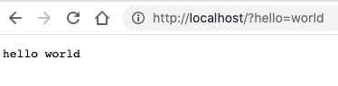
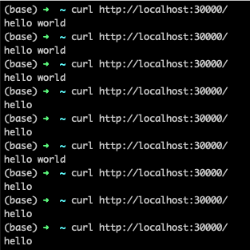

## a web helloworld docker image 

```
docker pull mirrors2/helloworld

docker run -itd --rm --name helloworld -p 80:80 mirrors2/helloworld

#curl localhost?hello=world
```

Open in Browser http://localhost:30000


## run in k8s
```
kubectl apply -f deployment/helloworld.yaml

kubectl get svc -o wide

kubectl get pods -o wide 

kubectl logs -f [pod name] 

```



